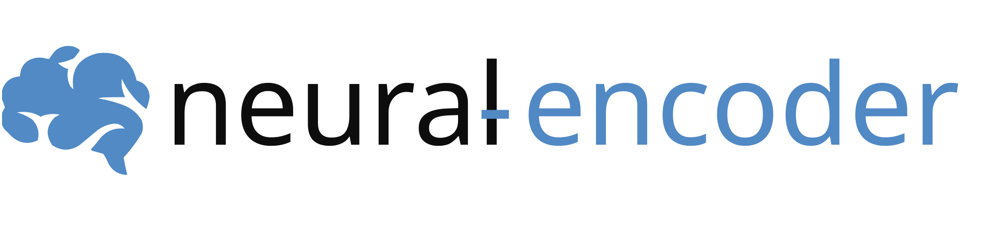
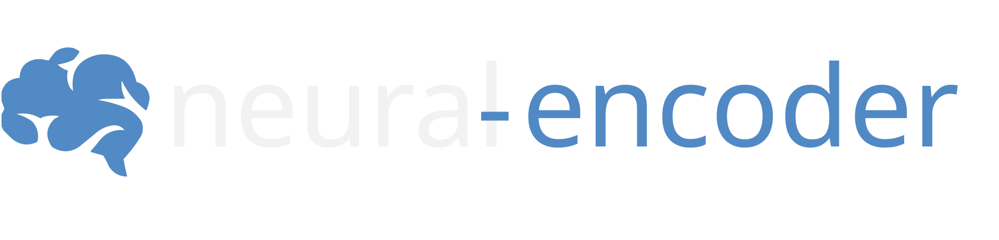

neural-encoder
==============

.. raw:: html

   

     
     
     
     
     
     
     
   

**neural-encoder** learns embeddings from repeated measurements and multiview
data. It was designed for single-trial fMRI responses and other
high-dimensional, noisy measurements in which several observations correspond
to the same underlying sample.

The encoder learns the signal shared across repetitions or views and maps each
measurement to a low-dimensional representation. Repeated measurements are
used during training; after fitting, individual measurements can be encoded
independently.

The method is based on `Platonic Representations in the Human Brain:
Unsupervised Recovery of Universal Geometry
<https://arxiv.org/abs/2605.20496>`_. It combines feature reliability
weighting, PCA, cross-view ridge denoising, distilled multiset canonical
correlation analysis (MCCA), reliability weighting of the embedding
dimensions, and nonlinear residual refinement.

Quick start
-----------

Fit from a matrix containing all repeated measurements. ``sample_ids`` gives
the identity of the underlying sample represented by each row:

.. code-block:: python

   from neural_encoder import NeuralEncoder

   encoder = NeuralEncoder()
   Z_train = encoder.fit_transform(X_train, sample_ids=sample_ids)
   Z_test = encoder.transform(X_test)

You can also fit from separate, aligned views. Corresponding rows of ``X1``,
``X2``, and ``X3`` must describe the same sample:

.. code-block:: python

   encoder = NeuralEncoder()
   encoder.fit_views([X1, X2, X3])

   Z1, Z2, Z3 = (encoder.transform(X) for X in (X1, X2, X3))

See :doc:`usage` for preprocessing, configuration, evaluation, and PyTorch
export.

.. toctree::
   :maxdepth: 2
   :caption: User guide

   installation
   concepts
   usage
   examples/index

.. toctree::
   :maxdepth: 2
   :caption: Reference

   api/index
   citation
   acknowledgements

Indices
-------

* :ref:`genindex`
* :ref:`modindex`
